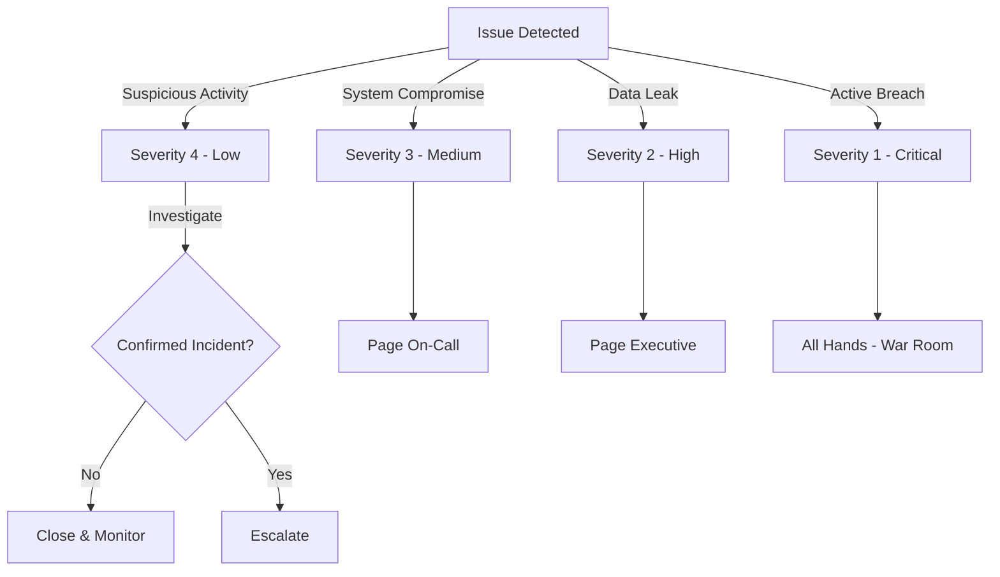

# Phase 3: External Security Testing & Advanced Controls

## Overview

Phase 3 focuses on:
1. **Advanced Access Controls** - Row-level security, audit logging
2. **External Security Testing** - Professional penetration test, bug bounty
3. **Incident Response** - Runbooks, escalation procedures
4. **Compliance Preparation** - SOC 2 documentation, audit readiness
5. **Monitoring & Detection** - Security dashboards, threat detection

**Timeline**: Month 2-6  
**Effort**: 80-120 hours  
**Risk Level**: Medium (external testing may identify new issues)

---

## 1. Advanced Access Controls

### 1.1 PostgreSQL Row-Level Security (RLS)

**Objective**: Ensure users can only see records they have permission to access, even if they bypass the API.

**Implementation**:

```sql
-- Enable RLS on sensitive tables
ALTER TABLE contacts ENABLE ROW LEVEL SECURITY;
ALTER TABLE donations ENABLE ROW LEVEL SECURITY;
ALTER TABLE accounts ENABLE ROW LEVEL SECURITY;
ALTER TABLE volunteers ENABLE ROW LEVEL SECURITY;

-- Create policy: Users can see contacts in their organization
CREATE POLICY contacts_org_policy ON contacts
  FOR SELECT
  USING (account_id IN (
    SELECT account_id FROM user_organization_access 
    WHERE user_id = current_user_id()
  ));

-- Create policy: Users can only update own organization's contacts
CREATE POLICY contacts_update_policy ON contacts
  FOR UPDATE
  USING (account_id IN (
    SELECT account_id FROM user_organization_access 
    WHERE user_id = current_user_id()
  ))
  WITH CHECK (account_id IN (
    SELECT account_id FROM user_organization_access 
    WHERE user_id = current_user_id()
  ));

-- Create policy: Admins bypass RLS
CREATE POLICY contacts_admin_policy ON contacts
  FOR ALL
  USING (current_role = 'admin');
```

**Expected Outcome**: Even if user gets direct database access, they see only their organization's data.

### 1.2 PostgreSQL Audit Logging

**Objective**: Track all data changes for compliance audits.

**Implementation**:

```sql
-- Create audit log table
CREATE TABLE audit_log (
  id UUID PRIMARY KEY DEFAULT uuid_generate_v4(),
  table_name VARCHAR(100) NOT NULL,
  operation VARCHAR(10) NOT NULL, -- INSERT, UPDATE, DELETE
  record_id UUID NOT NULL,
  old_values JSONB,
  new_values JSONB,
  changed_by UUID REFERENCES users(id),
  changed_at TIMESTAMP WITH TIME ZONE DEFAULT CURRENT_TIMESTAMP,
  query_text TEXT
);

-- Create audit trigger function
CREATE OR REPLACE FUNCTION audit_trigger_func()
RETURNS TRIGGER AS $$
BEGIN
  IF TG_OP = 'DELETE' THEN
    INSERT INTO audit_log (table_name, operation, record_id, old_values, changed_by, query_text)
    VALUES (TG_TABLE_NAME, TG_OP, OLD.id, row_to_json(OLD), current_user_id(), current_query());
    RETURN OLD;
  ELSIF (TG_OP = 'UPDATE') THEN
    INSERT INTO audit_log (table_name, operation, record_id, old_values, new_values, changed_by, query_text)
    VALUES (TG_TABLE_NAME, TG_OP, NEW.id, row_to_json(OLD), row_to_json(NEW), current_user_id(), current_query());
    RETURN NEW;
  ELSIF (TG_OP = 'INSERT') THEN
    INSERT INTO audit_log (table_name, operation, record_id, new_values, changed_by, query_text)
    VALUES (TG_TABLE_NAME, TG_OP, NEW.id, row_to_json(NEW), current_user_id(), current_query());
    RETURN NEW;
  END IF;
END;
$$ LANGUAGE plpgsql;

-- Attach audit trigger to all sensitive tables
CREATE TRIGGER contacts_audit AFTER INSERT OR UPDATE OR DELETE ON contacts
  FOR EACH ROW EXECUTE FUNCTION audit_trigger_func();
CREATE TRIGGER donations_audit AFTER INSERT OR UPDATE OR DELETE ON donations
  FOR EACH ROW EXECUTE FUNCTION audit_trigger_func();
```

**Expected Outcome**: Every data change is logged with who changed it, when, and what changed.

### 1.3 MFA Enforcement Dashboard

**Objective**: Admin can see which users have NOT enrolled in MFA and enforce enrollment.

**Implementation** (backend):

```typescript
// backend/src/controllers/mfaEnforcementController.ts
export class MFAEnforcementController {
  async getMFAEnforcementStatus(req: AuthenticatedRequest, res: Response) {
    const result = await pool.query(`
      SELECT 
        u.id, u.email, r.name as role,
        CASE WHEN uw.webauthn_id IS NOT NULL THEN true ELSE false END as has_mfa,
        u.last_login,
        (NOW() - u.last_login)::interval as days_since_login
      FROM users u
      JOIN user_roles ur ON u.id = ur.user_id
      JOIN roles r ON ur.role_id = r.id
      LEFT JOIN webauthn_credentials uw ON u.id = uw.user_id
      WHERE r.mfa_required = true
      ORDER BY has_mfa ASC, u.last_login DESC
    `);

    return res.json({
      data: {
        total_mfa_required: result.rowCount,
        mfa_enrolled: result.rows.filter(r => r.has_mfa).length,
        mfa_not_enrolled: result.rows.filter(r => !r.has_mfa).length,
        users: result.rows,
      }
    });
  }

  async sendMFAReminder(req: AuthenticatedRequest, res: Response) {
    const { userId } = req.body;

    const user = await pool.query(
      'SELECT email FROM users WHERE id = $1',
      [userId]
    );

    // Send email reminder
    await emailService.sendMFAReminder(user.rows[0].email);

    // Log the reminder
    logger.info('MFA reminder sent', { userId, email: user.rows[0].email });

    return res.json({ message: 'Reminder sent' });
  }

  async enforceMFADeadline(req: AuthenticatedRequest, res: Response) {
    const { deadline_days } = req.body;

    const deadline = new Date();
    deadline.setDate(deadline.getDate() + deadline_days);

    await pool.query(
      `UPDATE roles SET mfa_enforcement_deadline = $1 WHERE mfa_required = true`,
      [deadline]
    );

    logger.info('MFA enforcement deadline set', { deadline, deadline_days });

    return res.json({ message: `Deadline set to ${deadline_days} days from now` });
  }
}
```

**Frontend Component** (React):

```typescript
// frontend/src/pages/admin/MFAEnforcement.tsx
export function MFAEnforcement() {
  const [status, setStatus] = useState(null);

  useEffect(() => {
    api.get('/admin/mfa-enforcement-status').then(res => setStatus(res.data));
  }, []);

  return (
    <div>
      <h1>MFA Enforcement Status</h1>
      
      <div className="stats">
        <div>{status?.data.total_mfa_required} Users Should Have MFA</div>
        <div className="success">{status?.data.mfa_enrolled} ✓ Have MFA</div>
        <div className="warning">{status?.data.mfa_not_enrolled} ✗ Missing MFA</div>
      </div>

      <table>
        <thead>
          <tr>
            <th>Email</th>
            <th>Role</th>
            <th>MFA Status</th>
            <th>Last Login</th>
            <th>Actions</th>
          </tr>
        </thead>
        <tbody>
          {status?.data.users.map(user => (
            <tr key={user.id}>
              <td>{user.email}</td>
              <td>{user.role}</td>
              <td>{user.has_mfa ? '✓' : '✗'}</td>
              <td>{user.last_login}</td>
              <td>
                <button onClick={() => sendReminder(user.id)}>Send Reminder</button>
              </td>
            </tr>
          ))}
        </tbody>
      </table>
    </div>
  );
}
```

---

## 2. PostgreSQL Query Audit Logging

**Objective**: Log slow queries and suspicious database access patterns.

Enable in PostgreSQL configuration:

```ini
# postgresql.conf
log_statement = 'all'  # Log all statements (or 'mod' for modifications only)
log_min_duration_statement = 1000  # Log queries taking >1 second
log_connections = on
log_disconnections = on
log_statement_stats = on

# Log file settings
log_directory = 'pg_log'
log_filename = 'postgresql-%a.log'
log_truncate_on_rotation = on
log_rotation_age = 1d
log_line_prefix = '%t [%p]: [%l-1] user=%u,db=%d,app=%a,client=%h '
```

Forward logs to centralized logging service via Filebeat or Fluent/Bit.

---

## 3. External Security Testing

### 3.1 Penetration Testing Scope

**Objectives**:
- Identify vulnerabilities before attackers do
- Validate security controls are effective
- Test incident response procedures
- Verify compliance with security standards

**Scope Document**:

```markdown
# Penetration Test Scope

## Systems In Scope
- API Backend (backend.nonprofit-manager.com)
- Frontend SPA (app.nonprofit-manager.com)
- Admin Dashboard (admin.nonprofit-manager.com)
- Database (internal, restricted access)
- Infrastructure (Docker, TLS certificates)

## Out of Scope
- Third-party services (Stripe, Mailchimp)
- Employee systems (Slack, Gmail)
- Physical security
- Social engineering

## Testing Methods Authorized
✓ Network reconnaissance
✓ Web application testing (OWASP Top 10)
✓ API security testing
✓ Authentication/authorization testing
✓ Encryption validation
✓ Rate limiting testing
✓ Denial of service simulation (limited)
✗ Phishing campaigns
✗ Brute force attacks (limit to 100 attempts)
✗ Data exfiltration

## Constraints
- Testing window: 2025-03-15 to 2025-04-15
- No disruption to production services
- Contact bryan.crockett@westcat.ca on finding critical issues
- Final report due within 2 weeks of testing completion

## Expected Vulnerabilities
- OWASP Top 10 (if any)
- Cryptographic weaknesses
- Access control bypasses
- Injection vulnerabilities
- Sensitive data exposure
```

### 3.2 Selecting a Penetration Testing Firm

**Recommended Approach**:

1. **Request for Proposal (RFP)** to 3-5 firms:
   - Specify scope from above
   - Request methodology (NIST SP 800-115, OWASP)
   - Ask for references from similar-sized organizations
   - Request insurance/liability coverage

2. **Evaluation Criteria**:
   - OSCP certified testers (minimize)
   - Experience with healthcare/nonprofit sector
   - Clear communication and reporting
   - Cost: $40k-$60k for comprehensive assessment

3. **Firms to Consider**:
   - Mandiant (Fortune 500, expensive)
   - Synopsys (mid-market, good reports)
   - Coalfire (nonprofit-friendly pricing)
   - Veracode (cloud-focused)

### 3.3 Post-Penetration Testing

**After Report Received**:

```
Timeline:
Day 1-5: Review findings, triage severity
Day 6-10: Assign fixes to sprint
Day 11-30: Implement fixes
Day 31-45: Retest with pen test firm (remediation test)
Day 46: Define security roadmap
```

---

## 4. Bug Bounty Program

### 4.1 Program Design

**Platform**: HackerOne (recommended) or Bugcrowd

**Scope**:
```javascript
{
  "scope": {
    "in": [
      "api.nonprofit-manager.com",
      "app.nonprofit-manager.com",
      "admin.nonprofit-manager.com"
    ],
    "out": [
      "*.stripe.com",
      "*.mailchimp.com",
      "social.example.com"
    ]
  },
  "severity_ratings": {
    "critical": "$2,500",    // Auth bypass, RCE, data breach
    "high": "$1,500",         // SQL injection, CSRF, XSS
    "medium": "$500",         // Logic flaws, info disclosure
    "low": "$100"             // Best practices, docs
  },
  "constraints": {
    "no_dos": true,
    "no_phishing": true,
    "responsible_disclosure": {
      "grace_period_days": 90,
      "safe_harbor": true
    }
  }
}
```

**Budget**: $500-$1,000/month for first 6 months (~$3k-6k total)

### 4.2 Metrics to Track

- Submissions per month (expect 5-20)
- Duplicate rate (30-50% typical)
- Valid vulnerabilities found (10-40% of submissions)
- Time to fix (target: critical <1 day, high <7 days)
- Researcher engagement (thank you messages, response time)

---

## 5. Incident Response & Runbook

### 5.1 Security Incident Response Plan

**Objective**: Respond to security incidents in coordinated, documented manner.

**Roles**:
- **Incident Commander** (CTO/Security Lead) - Overall coordination
- **Technical Lead** (Backend Engineer) - System investigation
- **Communications Lead** (PM/Comms) - Stakeholder updates
- **Forensics Lead** (DevOps) - Data collection/preservation
- **Legal** (External) - Regulatory notifications

**Escalation Thresholds**:



### 5.2 Incident Runbook Template

**Critical Issues Runbook**:

```markdown
# Incident Runbook: Unauthorized Data Access

## Severity: CRITICAL

## Detection
- Monitoring alerts: Unusual database queries, rate limiting triggers
- Reports: User reports missing data, unexpected emails, etc.

## Initial Response (0-15 min)
1. Page on-call infrastructure lead
2. Create war room: war-room-202X-XX-XX Slack channel
3. Preserve evidence:
   ```bash
   # Capture system state BEFORE making changes
   docker logs backend-api > /tmp/incident-$(date +%s).log
   docker exec postgres pg_dump -U postgres nonprofit_manager > /incident-backup.sql
   ```
4. Isolate if necessary:
   - Kill suspicious connections: `SELECT pg_terminate_backend(pid) WHERE ...`
   - Rate limit attacker IP if known

## Investigation (15-60 min)
1. Query system logs:
   ```sql
   SELECT * FROM pii_access_audit 
   WHERE accessed_at > NOW() - INTERVAL '1 hour'
   ORDER BY accessed_at DESC;
   ```
2. Check failed authentication logs:
   ```bash
   grep -i "failed\|unauthorized" logs/combined.log | tail -100
   ```
3. Review API access patterns:
   ```sql
   SELECT endpoint, method, COUNT(*) as requests, COUNT(DISTINCT ip) as ips
   FROM api_request_log
   WHERE logged_at > NOW() - INTERVAL '1 hour'
   GROUP BY endpoint, method
   ORDER BY requests DESC;
   ```
4. Determine impact scope:
   - Which records were accessed?
   - Which users are affected?
   - What data was exposed?

## Mitigation (60-120 min)
1. Revoke compromised API keys/credentials
   ```sql
   UPDATE api_keys SET is_active = false WHERE id IN (...);
   ```
2. Reset passwords for affected users
3. Enable enhanced monitoring
4. Consider: Take system offline if active breach

## Notification (120+ min)
- Notify users: "Your account may have been accessed. Please change your password."
- Notify regulators: GDPR (72 hours), state AG (varies by state)
- External communication: Blog post, email, SMS

## Post-Incident (1-7 days)
1. Full forensic analysis
2. Root cause analysis (RCA)
3. Remediation: Patches, configs, process improvements
4. Post-mortem meeting with team
5. External audit/assessment if needed

## Metrics to Track
- Time to detect: When was incident first noticed?
- Time to contain: When was/could it have been stopped?
- Time to notify: When were users informed?
- Scope: How many users affected?
- Cause: What was the root cause?
```

### 5.3 Contact Information & Escalation

**Keep Updated & Accessible**:

```yaml
# incident-response.yml
incident_commander:
  - name: "Bryan Crockett"
    title: "CTO"
    email: "bryan.crockett@westcat.ca"
    phone: "+1-XXX-XXX-XXXX"
    
technical_lead:
  - name: "DevOps Engineer"
    always_on_call: true
    
legal_counsel:
  - name: "External Legal Firm"
    email: "counsel@lawfirm.com"
    response_time: "1 hour"
    
compliance_officer:
  - name: "Internal Compliance"
    notifications_required:
      - GDPR: 72 hours
      - HIPAA: 60 days
      - State AG: Varies by state
```

---

## 6. Monitoring & Detection

### 6.1 Security Dashboards

Create in Kibana/Grafana:

**Dashboard 1: Authentication Security**
- Login attempts per user (alert if > 10/hour)
- Failed logins by IP (alert if > 5/minute)
- MFA enrollment rate (target: 100% for admins)
- Session duration anomalies

**Dashboard 2: Data Access**
- PII access by role (alert if > threshold)
- Rows accessed per query (alert if > 10,000)
- Deleted records (audit who/when)
- Encryption errors

**Dashboard 3: API Health**
- Request rate by endpoint
- Error rate by status code
- Response time percentiles (p50, p95, p99)
- Rate limit hits (find abuse patterns)

**Dashboard 4: Infrastructure**
- Database connection pool exhaustion
- Slow queries (>1 second)
- Disk usage growth rate
- Memory/CPU utilization

### 6.2 Alert Rules

```yaml
alerts:
  - name: "Multiple failed logins"
    condition: "count(level:error AND message:login.failed) > 5 within 5m"
    severity: "HIGH"
    actions:
      - notify_security_team
      - disable_user_account  # Optional
      
  - name: "Unusual API access pattern"
    condition: "endpoint:/api/contacts AND rows>10000 AND request_duration>5000ms"
    severity: "MEDIUM"
    actions:
      - notify_on_call
      - create_incident_ticket
      
  - name: "PII decryption error"
    condition: "message:Failed to decrypt AND level:error"
    severity: "CRITICAL"
    actions:
      - page_security_team_immediately
      - create_p1_incident
      
  - name: "Database audit log backlog"
    condition: "audit_log table growth > 10GB/day"
    severity: "MEDIUM"
    actions:
      - notify_dba
      - recommend_partition_strategy
```

---

## 7. Phase 3 Implementation Roadmap

### Week 1-2: Advanced Database Controls
- [x] Design PostgreSQL RLS policies
- [x] Create audit logging triggers
- [x] Test RLS with multiple roles

### Week 3-4: Admin Dashboards
- [ ] Build MFA enforcement dashboard
- [ ] Create security monitoring views
- [ ] Set up Kibana dashboards

### Week 5-6: Documentation & Planning
- [x] Write penetration test scope
- [x] Create incident response runbooks
- [ ] Select pen test firm (RFP process)
- [ ] Design bug bounty program

### Week 7-8: External Testing
- [ ] Onboard penetration test firm
- [ ] Launch bug bounty program on HackerOne
- [ ] Enable PostgreSQL audit logging
- [ ] Deploy security dashboards

### Week 9+: Remediation & Continuous Improvement
- [ ] Address pen test findings
- [ ] Respond to bug bounty submissions
- [ ] Monitor and tune security dashboards
- [ ] Plan SOC 2 compliance audit

---

## 8. Expected Outcomes

### Metrics to Achieve

| Metric | Target | Current | Gap |
|--------|--------|---------|-----|
| MFA enrollment (admin users) | 100% | ~60% | Enforce via dashboard |
| PII fields encrypted | 100% | ~20% | Batch migration script |
| Query audit logging | 100% | 0% | Enable in PostgreSQL |
| Row-level security policies | 100% | 0% | Create RLS policies |
| Incident response team | Trained | Not yet | Training + runbooks |
| Penetration test | Completed | Not started | RFP + engagement |
| Bug bounty submissions | 20+ per month | 0 | Launch program |
| Security monitoring SLA | 99.9% uptime | NA | Deploy dashboards |

### Compliance Milestones

- **HIPAA**: Audit logging, encryption, access controls ✓
- **GDPR**: Data minimization, right to deletion, audit trail ✓
- **SOC 2**: Continuous monitoring, incident response, change management
- **PCI DSS**: Encryption, tokenization, quarterly testing
- **CCPA**: Consumer data access request handling, audit trail

---

## 9. Budget & Resource Allocation

| Item | Cost | Timeline | Owner |
|------|------|----------|-------|
| PostgreSQL RLS design | 8 hrs | Week 1-2 | DBA |
| Dashboard development | 16 hrs | Week 3-4 | Frontend dev |
| Incident response planning | 6 hrs | Week 5-6 | CTO |
| Penetration test | $50k | Week 7-8 | Vendor |
| Bug bounty management | $5k/yr | Ongoing | Security |
| Monitoring & dashboards | 12 hrs | Week 7-8 | DevOps |
| **Total Estimated** | **~$55k** | **8 weeks** | **Team** |

---

## 10. Success Criteria

Phase 3 is complete when:

- [ ] PostgreSQL RLS policies deployed to production
- [ ] Audit logging enabled and monitored
- [ ] MFA enforcement dashboard live
- [ ] Incident response runbooks tested with team
- [ ] Penetration test completed and findings triaged
- [ ] Bug bounty program launched with >20 submissions
- [ ] All findings fixed or approved as acceptable risk
- [ ] Security dashboards monitoring 24/7
- [ ] Team trained on incident response procedures
- [ ] Compliance audit scheduled for Q2 2026

---

## Next Steps

**Immediate (This Sprint)**:
1. Review and approve Phase 3 plan with security team
2. Schedule RFP for penetration testing (request: 3-5 proposals)
3. Create incident response team and schedule training
4. Begin PostgreSQL RLS policy design with DBA
5. Identify Kibana/Grafana administrator for dashboard work

**Recommended Reading**:
- NIST SP 800-61 (Incident Response)
- OWASP Top 10 2021
- PostgreSQL RLS Documentation
- HackerOne Program Best Practices

---

**Status**: Ready to Begin  
**Approval Required**: Security team sign-off  
**Target Start Date**: February 16, 2026  
**Target Completion**: April 30, 2026
